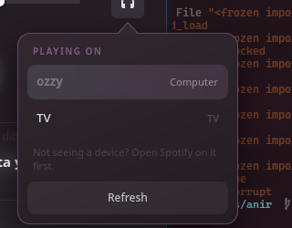

# waytify

Media control for Waybar, built on MPRIS with optional Spotify enrichment.

Written in Rust. Themed with CSS.


The colours are not in the stylesheet. waytify takes them from the album cover,
so the border, the scrubber, the play button and the line being sung all follow
whatever is playing. The theme above ships as
[`contrib/themes/burning-cherry.css`](contrib/themes/burning-cherry.css).



> **Status: early but usable.** The Spotify layer is optional: without it you
> still get a full player for any MPRIS source. See [roadmap](#roadmap).

## Why this exists

A Waybar custom module is a subprocess whose stdout Waybar reads. The entire
protocol is this:

```json
{"text": "...", "alt": "...", "tooltip": "...", "class": "...", "percentage": 0}
```

`text` becomes a Pango label. `tooltip` becomes another Pango label. `class`
gets appended to the widget's CSS classes. Clicks and scrolls run shell
commands you configure.

There is no way to express a seek bar, album art, a device list, or scrolling
lyrics. That is why nearly every Spotify module for Waybar is a `playerctl`
call in a loop: authors reach the limit of a string and stop there.

waytify splits along that seam. The bar shows what a string can show. Everything
else lives in a separate window that Waybar knows nothing about, which also
means the player half works under any bar, or under none.

That window is a `gtk4-layer-shell` surface. Album art, a scrubber you can
actually drag, transport, volume, lyrics that scroll with the song, what is
playing next, and the list of devices you can move playback to. The stylesheet
is a file you can edit while the window is open.

## Install

On Arch, from the [AUR](https://aur.archlinux.org/packages/waytify):

```sh
paru -S waytify     # or yay, or makepkg -si in a clone of the AUR repo
```

Anywhere else, build it. Requires Rust 1.92 or newer, which is what the GTK4
bindings need. A build without the window (`--no-default-features`) has the same
floor today but does not depend on GTK at all.

```sh
git clone https://github.com/IlyasKhallouki/waytify
cd waytify
cargo install --path crates/waytify
```

That puts a single `waytify` binary in `~/.cargo/bin`. The AUR package installs
it to `/usr/bin`, which is already on Waybar's PATH and saves you the step
below.

### Make sure Waybar can find it

This one is worth two minutes now rather than an hour later.

Waybar runs your module with the PATH of the session that started it, not the
PATH of the terminal you installed from. `~/.cargo/bin` is usually added by your
shell's config, which a compositor launching Waybar at login never reads. So
`waytify` works perfectly when you type it and is invisible to Waybar.

The failure is quiet and misleading. Waybar keeps displaying the last output a
module produced, so instead of an obviously empty widget you get one frozen on a
track from earlier, with a play icon that no longer matches what you are hearing.
It looks like a sync bug rather than a missing binary.

Check what Waybar can actually see:

```sh
tr '\0' '\n' < /proc/$(pgrep -x waybar | head -1)/environ | grep ^PATH=
```

If `~/.cargo/bin` is not in there, put waytify somewhere that is. `~/.local/bin`
is on the default PATH of most distributions:

```sh
mkdir -p ~/.local/bin
ln -sf ~/.cargo/bin/waytify ~/.local/bin/waytify
```

A symlink rather than a copy, so future `cargo install` runs are picked up
without repeating this.

## Waybar setup

Add a module:

```jsonc
"custom/waytify": {
  "exec": "waytify bar",
  "return-type": "json",
  "restart-interval": 1,
  "on-click": "waytify toggle",
  "on-click-right": "waytify next",
  "on-click-middle": "waytify play-pause",
  "on-scroll-up": "waytify seek +10",
  "on-scroll-down": "waytify seek -10",
  "max-length": 45
}
```

Then put `custom/waytify` in one of your `modules-*` arrays.

Left click opens the player window. That binding matters more than it looks: with
transport on the left button there is nothing that opens the window, and the
whole thing looks like a text label that pauses music.

There is no `interval`. `waytify bar` is a long-lived process that prints a line
when something changes, so the bar updates on the event rather than on a timer.
The daemon starts on its own the first time any client needs it.

`restart-interval` matters more than it looks. Waybar goes on displaying the last
output a module produced after that module's process exits, so without it, a
client that dies for any reason leaves a widget frozen on an old track rather
than an empty one. This respawns it a second later.

Do not set `"escape": true`. waytify escapes track metadata itself and leaves
your template's markup alone, so `<b>{title}</b>` works while an ampersand in a
song title stays safe. Turning on Waybar's own escaping would double-escape the
first and break the second.

A copy of this module and a starting stylesheet live in
[`contrib/waybar/`](contrib/waybar/).

### If your config is generated

Some setups, HyDE among them, rewrite `config.jsonc` whenever the bar layout
changes, which silently removes `custom/waytify` from wherever you put it.

Dropping the module file into `~/.config/waybar/modules/` survives that, since
the default config includes that directory by glob. The placement does not. If
your module disappears after a theme or layout change, add it to your own layout
file rather than to `config.jsonc`.

## The player window

Clicking the module opens it. It appears on the monitor you clicked, under the
pointer, and closes on Escape or a click anywhere outside it.

```sh
waytify toggle          # open under the pointer, or close if already open
```

For a Hyprland keybind, so it works without a bar at all:

```conf
bindl = , XF86AudioPlay,  exec, waytify play-pause
bindl = , XF86AudioNext,  exec, waytify next
bindl = , XF86AudioPrev,  exec, waytify previous
bind  = SUPER, M,         exec, waytify toggle
```

The window is a layer-shell surface rather than a Waybar plugin, so none of this
depends on Waybar running.

It shows lyrics when [lrclib](https://lrclib.net) has them, three lines at a
time with the line being sung in the middle. That needs no account and no Spotify: it is looked
up from the artist, title and length of whatever is playing. Nothing is
requested unless the window is actually on screen, and both hits and misses are
cached.

The line at the top says what you are playing out of, and clicking it lists your
playlists so you can play something else. The magnifier beside it searches
Spotify for songs, albums and playlists, and playing one is a click. With a Spotify account connected the
window also lists what is playing next, folded away until you ask for it, and lets you move playback between Connect devices.
Spotify only reports devices with a live session, so a phone with the app closed
will not be listed even though the Spotify app itself shows it: the app does its
own discovery on the local network, and the Web API exposes no equivalent. Clicking one of those plays it, when playback came from a
playlist or album: Spotify cannot move through a queue, but it can restart a
context at a chosen item, which amounts to the same thing. The list appears only
while a Spotify track is playing: your account still has a queue
during a browser video, but showing it there would be describing the wrong thing.

It starts on first use and then stays resident, hidden, so reopening is instant.
Starting GTK takes long enough that opening it fresh on every click feels broken.

## Styling

There is a worked example in [`contrib/themes/burning-cherry.css`](contrib/themes/burning-cherry.css),
written against a Rosé Pine desktop. It takes its accents from `@art_vibrant`
and `@art_muted`, so the border, the scrubber, the play button and the line
being sung all change colour with the album cover.

The bar module and the window are styled in two different places, and both are
documented in full in [`docs/THEMING.md`](docs/THEMING.md).

The module emits CSS classes describing the current state, so you can style it
from your existing Waybar stylesheet:

```css
#custom-waytify.playing  { color: @green; }
#custom-waytify.paused   { color: @overlay1; }
#custom-waytify.no-player { opacity: 0; }
```

| Class | When |
| --- | --- |
| `playing`, `paused`, `stopped` | Current playback state |
| `no-player` | Nothing is running |
| `liked` | Current track is saved to your library |
| `remote` | Audio is on a Spotify Connect device, not this machine |
| `no-premium` | An account is connected but cannot use playback controls |

The last three arrive with the Spotify layer and are listed here so a stylesheet
written now keeps working later.

The window reads `~/.config/waytify/style.css` and reloads it as you save, so you
can leave it open while you edit. Colours pulled from the current album art are
available as `@art_vibrant`, `@art_muted` and `@art_on_vibrant` for a theme that
wants to follow the record.

## Configuration

Everything has a default, so the config file is optional. To start from a
commented copy of the defaults:

```sh
mkdir -p ~/.config/waytify
waytify config > ~/.config/waytify/config.toml
```

```toml
[player]
# Which player to favour when several are running. Short name or full bus name.
# Preference only breaks ties between players in the same state: whatever is
# actually playing always wins, so the bar cannot disagree with your speakers.
preferred = ["spotify"]

# Follow these and nothing else. Empty, the default, follows whatever is
# running, which is what makes this a media widget rather than a Spotify one.
# Listing anything makes the rest invisible, so a video in a browser tab cannot
# take the bar over just by being the thing making noise.
only = []

[bar]
# When the module appears at all.
#   "running"  whenever a player is running, playing or paused. The default.
#   "playing"  only while something is actually playing. Note that pausing then
#              hides the module, so resume from the window or a keybind.
#   "always"   even with nothing running, which renders format_stopped.
#
# Whenever the module renders nothing, it adds an "empty" class. Waybar keeps
# the widget either way, so a stylesheet with padding or a background leaves an
# empty pill on the bar without a rule like:
#   #custom-waytify.empty { background: none; padding: 0; margin: 0; }
show = "running"

[bar]
format = "{icon}  {title}[ · {artist}]"
tooltip = "{title}[\n{artist}][\n{album}][\n\n{position} / {duration}]"

[bar.icons]
playing = "▶"
paused = "⏸"
stopped = "⏹"

[lyrics]
# Looked up from lrclib.net, which needs no account. This is the only request
# waytify makes to a service you have not already chosen to talk to, so it has
# its own switch. Nothing is sent but an artist, a title and a length, and only
# while the window is open.
enabled = true
```

### What it writes to disk

```
~/.config/waytify/config.toml    settings, entirely optional
~/.config/waytify/style.css      your stylesheet, watched for changes
~/.cache/waytify/art/            album covers, downscaled to 256px
~/.cache/waytify/lyrics/         lyrics, including which tracks have none
```

Nothing under `~/.cache` is needed to run, and deleting it is safe at any time.
It grows with the number of distinct tracks you play and is measured in tens of
megabytes rather than gigabytes, since covers are stored as thumbnails rather
than originals.

Your Spotify refresh token is not in any of these. It goes to the system keyring
through the Secret Service API, which is what GNOME Keyring and KWallet
implement.

### Template syntax

`{name}` inserts a value. Available names are `icon`, `status`, `title`,
`artist`, `album`, `player`, `position`, `duration`, and `percent`. A name
waytify does not recognise is left in the output untouched, so a typo shows up
on your bar instead of quietly disappearing.

`[ ... ]` marks an optional group. It renders only if every value inside it is
non-empty. This is what keeps `{title}[ · {artist}]` from leaving a stranded
separator on a podcast with no artist tag. Groups nest.

Nerd Font users will probably want different icons:

```toml
[bar.icons]
playing = "󰎆"
paused = "󰏤"
stopped = "󰓛"
```

The defaults are plain Unicode so a fresh install renders on any font.

## Spotify (optional)

Everything so far works with any MPRIS player and needs no account. Connecting
one adds a like button, the Connect device list, and moving playback between
devices.

You need your own Spotify application, which takes a couple of minutes. waytify
deliberately does not ship one: Spotify counts rate limits per application, so a
shared id would mean a shared budget for every user.

1. Open <https://developer.spotify.com/dashboard> and create an app.
2. Add a redirect URI of `http://127.0.0.1:8888/callback`. Spotify matches
   redirect URIs exactly, so waytify listens on that specific port rather than
   whichever one happens to be free. Change `redirect_port` and the registered
   URI together if 8888 is taken on your machine.
3. Copy the client id, which is not a secret, into your config:

```toml
[spotify]
client_id = "your-client-id"
# Must match the port in the redirect URI you registered. Spotify compares
# redirect URIs exactly, so this cannot be left to chance.
redirect_port = 8888
```

4. Log in once:

```sh
waytify login
```

That opens a browser, catches the redirect on a local port, and stores a refresh
token in your system keyring rather than in a file. `waytify logout` forgets it.

### Caching and attribution

Album covers are cached under `~/.cache/waytify/art/` as 256px thumbnails, which
is what makes reopening the window instant rather than a network round trip. That
is the only Spotify content kept on disk. Track names, playlist names and device
lists are held in memory for as long as they are on screen and nowhere else.

Content comes from Spotify and belongs to Spotify. waytify is not affiliated
with them.

### Development mode and the user allowlist

A new application starts in development mode, and in that state Spotify only
serves the Web API to accounts you have explicitly listed. Everything else works
and the library endpoints return 403, so the like button disappears while Connect
devices and transfer keep working.

Add yourself under **User Management** in the app's dashboard page, using the full
name and email on your Spotify account. Up to five accounts are allowed.

waytify records the refusal the first time it happens and stops asking, rather
than retrying on every track, and hides the control rather than offering one that
cannot work.

### What Premium changes

Every write to Spotify's playback endpoints requires Premium. On a free account
you keep the like button and the device list, and lose transferring playback and
remote volume. waytify checks once and hides what it cannot do, rather than
offering a control that fails when clicked.

## Commands

Useful as Hyprland keybinds or Waybar click actions.

```sh
waytify play-pause
waytify next
waytify previous
waytify seek 1:30      # jump to a position
waytify seek +10       # move forward ten seconds
waytify seek -10       # and back
waytify shuffle        # toggle
waytify repeat         # cycle off, playlist, track
waytify raise          # bring the player's window forward

waytify toggle         # open or close the player window
waytify status         # current state as JSON
waytify stop           # stop the daemon

waytify like           # save or unsave the current track
waytify login          # connect a Spotify account
waytify logout         # forget it again

waytify mock-player    # a fake player for testing, produces no audio
```

Every command reports its outcome. `waytify next` with nothing running exits
non-zero and says so, rather than failing quietly in a log you never read.

## How it works

Three processes from one binary.

The **daemon** holds the D-Bus connections, the canonical state, and the caches.
It is the only part that talks to the outside world. Waybar respawns its module
process on every config and style reload, so anything expensive to build has to
outlive that.

The **bar client** (`waytify bar`) streams rendered output to stdout and holds no
state. Format strings live in the daemon's config, so this side has no
formatting logic to get out of sync.

The **window** (`waytify popup`) is a `gtk4-layer-shell` surface. It renders
whatever the daemon last sent and sends commands back, holding no state, so it is
cheap to kill and restart.

Playback position is interpolated locally rather than polled. The daemon records
the position it last saw, advances it against the local clock, and re-anchors on
every property change. The MPRIS spec has a `Seeked` signal for this, but players
are inconsistent about emitting it, so nothing here depends on receiving one. A
paused player is never polled at all, and neither is one nobody is watching.

[`docs/ARCHITECTURE.md`](docs/ARCHITECTURE.md) has the full picture, including
which source owns which piece of state and why.

## Roadmap

Each stage is usable on its own.

- [x] **Daemon, bar module, transport.** Works with any MPRIS player, including
      mpv and Firefox. No configuration required.
- [x] **The player window.** GTK4 layer-shell surface with album art, a draggable
      scrubber and transport. Three-layer CSS with hot reload, and album art
      colours exposed to stylesheets.
- [x] **Volume routing.** The player's own volume rather than the system's,
      through PipeWire when it is playing here and through Spotify when it is
      playing somewhere else.
- [x] **Spotify layer.** OAuth via PKCE, likes, Connect devices and playback
      transfer, and an up-next list. Optional throughout: without it you still
      have a working player.
- [x] **Lyrics.** Synced lyrics from lrclib, scrolling with the position clock.

### On Spotify Premium

Every write to Spotify's `/me/player/*` endpoints requires Premium. Playback
transfer and remote volume will not work on a free account, and waytify will
hide those controls rather than offer buttons that fail when clicked. Reads are
unaffected, so likes, the queue, and the device list still work.

None of that touches the MPRIS layer. Transport, seeking, and the bar work the
same whether you have Premium, a free account, or no Spotify at all.

## Development

```sh
cargo test --workspace
```

Logging goes to stderr and is off below `info`. The filter is read from
`WAYTIFY_LOG`, not `RUST_LOG`, and it matches on crate names with underscores:

```sh
WAYTIFY_LOG=waytify_core=debug waytify daemon
```

There is a mock player for driving the window without a real one:

```sh
waytify mock-player                       # a small playlist on the session bus
WAYTIFY_MOCK_ART=~/cover.png waytify mock-player   # with cover art
WAYTIFY_MOCK_SPOTIFY=1 waytify mock-player         # with Spotify track links
```

`WAYTIFY_MOCK_SPOTIFY` matters because waytify decides whether a track is
Spotify's from its `xesam:url`, not from the player's name. Without it the mock
never exercises the like button or the queue.

The suite includes an end-to-end test that serves a mock MPRIS player on the
real session bus and drives the engine against it. The mock reports its track id
as a plain string rather than an object path and never emits `Seeked`, both of
which real players do. Those tests skip rather than fail when no session bus is
available.

## License

MIT. See [LICENSE](LICENSE).
